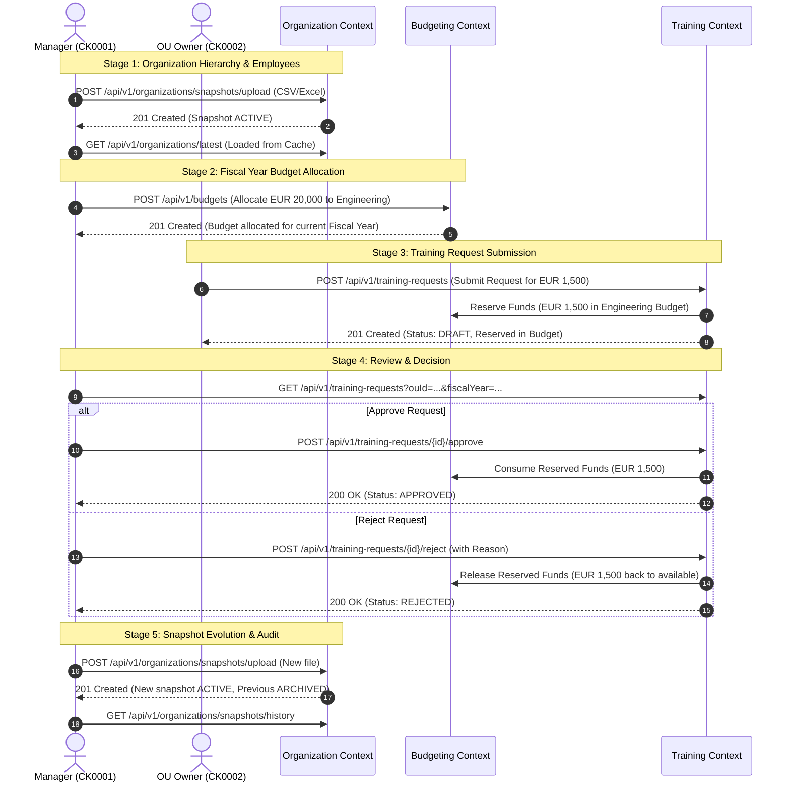

# End-to-End Workflow Testing Guide (Bruno Collection)

This document provides a step-by-step walkthrough to test the complete end-to-end business flow of the **OULearning Platform** using the Bruno collection in this directory.

---

## 1. Prerequisites & Setup

### 1.1 Start the Application
Start the Spring Boot backend server:
```bash
./mvnw spring-boot:run
```
The application will start on `http://localhost:8080` with Flyway migrations applied.

### 1.2 Open Bruno and Select Environment
1. Open [Bruno](https://www.usebruno.com/).
2. Click **Open Collection** and choose the `bruno` directory.
3. In the top-right environment selector, choose **local** (which defines `baseUrl = http://localhost:8080`).

---

## 2. Complete Workflow Test Flow (Step-by-Step)



---

## 3. Detailed Step Execution

### Stage 1: Organization & Employee Setup

#### Step 1.1 — Upload Active Organization Snapshot & Employees (CSV)
- **Folder**: `organization/`
- **Request**: `14-upload-organization-snapshot-csv.bru`
- **Method**: `POST /api/v1/organizations/snapshots/upload?managerCorporateKey=CK0001`
- **Body**: `multipart/form-data` with:
  - `file`: `samples/organization.csv` (Defines Acme Corp, Engineering, Backend Team)
  - `employeeFile`: `samples/employees.csv` (Defines CK0001 as MANAGER, CK0002 as EMPLOYEE in Engineering)
- **Expected Status**: `201 Created`
- **Validation**:
  - Response contains `snapshotId`, `createdAt`, `status: "ACTIVE"`.
  - Root unit `Acme Corp` has loaded children `Engineering` and `Backend Team`.

#### Step 1.2 — Retrieve Latest Organization (High-Performance Cache)
- **Folder**: `organization/`
- **Request**: `06-get-latest-organization-cached.bru`
- **Method**: `GET /api/v1/organizations/latest`
- **Expected Status**: `200 OK`
- **Validation**:
  - Fast sub-millisecond response loaded from memory cache.
  - Returns complete active hierarchy tree.

#### Step 1.3 — Query Employees by OU Hierarchy
- **Folder**: `organization/`
- **Request**: `13-get-employees-by-ou-subtree.bru`
- **Method**: `GET /api/v1/employees?ouId=22222222-2222-2222-2222-222222222222&subtree=true`
- **Expected Status**: `200 OK`
- **Validation**:
  - Returns employees of `Engineering` and all its child OUs (`Backend Team`).

---

### Stage 2: Fiscal Year Budget Allocation & Distribution

#### Step 2.1 — Allocate Budget to Engineering OU
- **Folder**: `budgeting/`
- **Request**: `01-allocate-budget.bru`
- **Method**: `POST /api/v1/budgets`
- **Payload**:
  ```json
  {
    "budgetId": "44444444-4444-4444-4444-444444444444",
    "ouId": "22222222-2222-2222-2222-222222222222",
    "amount": 20000.00,
    "currencyCode": "EUR"
  }
  ```
- **Expected Status**: `201 Created`
- **Validation**:
  - Budget is assigned for the current fiscal year.
  - `allocatedAmount = 20000.00`, `reservedAmount = 0.00`, `spentAmount = 0.00`, `availableAmount = 20000.00`.

#### Step 2.2 — Query Budget by OU and Fiscal Year
- **Folder**: `budgeting/`
- **Request**: `03-get-budget-by-ou.bru`
- **Method**: `GET /api/v1/budgets?ouId=22222222-2222-2222-2222-222222222222&fiscalYear=...`
- **Expected Status**: `200 OK`
- **Validation**:
  - Confirms budget numbers before training requests are placed.

---

### Stage 3: Training Request Submission (OU Owner)

#### Step 3.1 — Submit Training Request
- **Folder**: `training/`
- **Request**: `01-submit-training-request.bru`
- **Method**: `POST /api/v1/training-requests`
- **Payload**:
  ```json
  {
    "ouId": "22222222-2222-2222-2222-222222222222",
    "requesterCorporateKey": "CK0001",
    "name": "Advanced Domain-Driven Design and Clean Architecture",
    "costAmount": 1500.00,
    "costCurrency": "EUR",
    "purposeType": "UPSKILLING",
    "trainingHours": 40,
    "availableAtOrgUniversity": true,
    "assistantCorporateKeys": [
      "CK0001",
      "CK0002"
    ]
  }
  ```
- **Expected Status**: `201 Created`
- **Validation**:
  - Training Request is created with status `"DRAFT"`.
  - Copy the returned `id` (e.g. into Bruno collection variable `trainingRequestId`).

#### Step 3.2 — Verify Budget Fund Reservation
- **Folder**: `budgeting/`
- **Request**: `03-get-budget-by-ou.bru`
- **Expected Status**: `200 OK`
- **Validation**:
  - `reservedAmount = 1500.00`
  - `availableAmount = 18500.00` (20000 - 1500)
  - Funds are locked so other operations cannot exceed allocated budget.

---

### Stage 4: Manager Review & Approval / Rejection

#### Option A: Approval Flow
1. **Request**: `training/05-approve-training-request.bru`
2. **Method**: `POST /api/v1/training-requests/{{trainingRequestId}}/approve`
3. **Payload**:
   ```json
   {
     "managerCorporateKey": "CK0001",
     "managerNotes": "Approved for Q3 Engineering initiative"
   }
   ```
4. **Expected Status**: `200 OK`
5. **Validation**:
   - `status = "APPROVED"`
   - Check Budget (`budgeting/03-get-budget-by-ou.bru`):
     - `reservedAmount = 0.00`
     - `spentAmount = 1500.00`
     - `availableAmount = 18500.00`

#### Option B: Rejection Flow
1. Submit another request or use `training/02-submit-training-request-other-purpose.bru`.
2. **Request**: `training/06-reject-training-request.bru`
3. **Method**: `POST /api/v1/training-requests/{{trainingRequestId}}/reject`
4. **Payload**:
   ```json
   {
     "managerCorporateKey": "CK0001",
     "rejectionReason": "Budget reallocated to infrastructure priorities",
     "managerNotes": "Please resubmit next quarter"
   }
   ```
5. **Expected Status**: `200 OK`
6. **Validation**:
   - `status = "REJECTED"`
   - `rejectionReason` is recorded.
   - Check Budget: `reservedAmount` is released back to available budget (`availableAmount` restored).

#### Step 4.3 — Manager Query & Filtering
- **Folder**: `training/`
- **Request**: `07-filter-training-requests-manager.bru`
- **Method**: `GET /api/v1/training-requests?ouId=22222222-2222-2222-2222-222222222222&status=APPROVED`
- **Expected Status**: `200 OK`
- **Validation**:
  - Filter by OU, status, and requester.

---

### Stage 5: Snapshot Evolution & Audit Time-Travel

#### Step 5.1 — Upload New Snapshot File
- **Folder**: `organization/`
- **Request**: `15-upload-organization-snapshot-excel.bru` (or `14-upload-organization-snapshot-csv.bru`)
- **Expected Status**: `201 Created`
- **Validation**:
  - Returns new `snapshotId` with `status = "ACTIVE"`.

#### Step 5.2 — Audit Snapshot History
- **Folder**: `organization/`
- **Request**: `09-get-organization-history.bru`
- **Method**: `GET /api/v1/organizations/snapshots/history`
- **Expected Status**: `200 OK`
- **Validation**:
  - List of all snapshots: newest has `status = "ACTIVE"`, prior snapshots have `status = "ARCHIVED"`.

#### Step 5.3 — Time-Travel Audit Query
- **Folder**: `organization/`
- **Request**: `08-get-snapshot-at-timestamp.bru`
- **Method**: `GET /api/v1/organizations/snapshots?at=2026-08-17T00:00:00Z`
- **Expected Status**: `200 OK`
- **Validation**:
  - Materializes the historical organization tree exactly as it existed at that point in time.

---

## 4. Running via Bruno CLI (`bru`)

You can run the entire collection automatically in CI/CD or command line using the Bruno CLI:

```bash
# Run all organization tests
bru run organization --env local

# Run all budgeting tests
bru run budgeting --env local

# Run all training tests
bru run training --env local

# Run full test suite
bru run --env local
```
